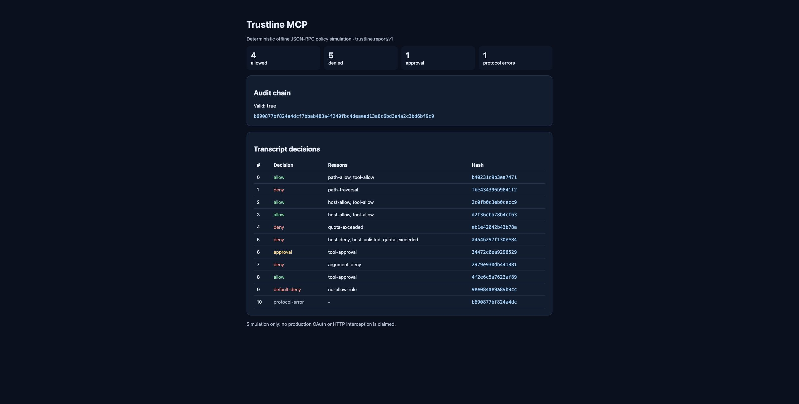

# Trustline MCP

Trustline MCP is a deterministic, zero-runtime-dependency policy lab for MCP-style `tools/call` JSON-RPC transcripts. It evaluates deny-overrides rules, simulates allowed fixture tools without executing commands, redacts secrets, and writes a chained audit that can be verified after the run.

It is deliberately honest about scope: this repository is an offline transcript proxy/simulator. It does **not** claim production OAuth enforcement, network interception, HTTP proxying, or sandbox isolation.



## Why it is different

- Deny always overrides allow and approval.
- Rules cover tool names, nested arguments, filesystem roots, hosts, quotas, and explicit approvals.
- Applicable path and host allowlists fail closed when their argument is missing, non-string, or malformed; approvals require a nonblank reviewer identity.
- Invalid or resource-unsafe configured regular expressions are rejected when the policy engine is constructed; the supported subset excludes grouping, alternation, backreferences, lookarounds, and repetition.
- Secret-bearing keys, URL credentials/query secrets, and common credential shapes are redacted before hashing.
- Runtime policy validation rejects malformed rule operators, effects, host/path lists, and quota limits before evaluation.
- Every matching quota is enforced; an earlier broad quota cannot hide a stricter overlapping quota.
- Every audit entry commits to the declared policy digest and previous entry with canonical JSON and SHA-256.
- The included attack fixture covers traversal, link-local access, quota exhaustion, destructive shell text, missing approval, unknown tools, and malformed JSON-RPC.
- Demo outputs are deterministic JSON, Markdown, and a self-contained HTML report.

## Quick start

Requires Node.js 22 or newer.

```bash
npm ci
npm test
npm run demo
node dist/src/cli.js verify artifacts/demo/audit.json
```

Open `artifacts/demo/index.html` after the demo.

To simulate checked-in inputs:

```bash
node dist/src/cli.js simulate fixtures/policy.json fixtures/attack-transcript.txt artifacts/fixture
```

The line-oriented `.txt` attack fixture intentionally ends with malformed JSON
to prove the protocol-error path; it is not advertised as a valid JSONL stream.

## Decision model

For one tool call, Trustline collects every matching rule and resolves it in this order:

1. any deny -> deny;
2. otherwise, unmet approval -> approval required;
3. otherwise, at least one allow or satisfied approval -> allow;
4. otherwise -> default deny.

An allowed call invokes only a hard-coded offline fixture implementation. `shell.safe` returns simulated output and never launches a process.

## Stable artifacts

- `trustline.policy/v1`
- `trustline.transcript/v1`
- `trustline.audit/v1`
- `trustline.audit-bundle/v1`
- `trustline.report/v1`

Breaking schema changes require a new version identifier.

An audit bundle contains the complete declared policy, its canonical digest, and the entries anchored to that digest. Verification proves bundle self-consistency and detects accidental or post-hoc mutation; it does not authenticate who created the policy or prevent an attacker from replacing and rehashing the entire unsigned bundle.

## Repository map

- `src/policy.ts` — deny-overrides engine and rule matching.
- `src/simulator.ts` — JSON-RPC parsing, fixture invocation, audit chaining, verification.
- `src/canonical.ts` — deterministic JSON, hashing, and redaction.
- `src/report.ts` — JSON, Markdown, and single-file HTML artifacts.
- `fixtures/` — line-oriented attack transcript (including one intentional
  malformed record) and matching policy.
- `tests/` — policy unit tests and end-to-end artifact/tamper tests.

See [architecture](docs/ARCHITECTURE.md), [limitations](docs/LIMITATIONS.md), and [research notes](docs/RESEARCH.md).

## Security

Treat policies as code and review them. A transcript simulation is not a security boundary. See [SECURITY.md](SECURITY.md).

## License

MIT

See the [roadmap](ROADMAP.md), [research notes](docs/RESEARCH.md), and [AI-assistance disclosure](AI_ASSISTED.md).
